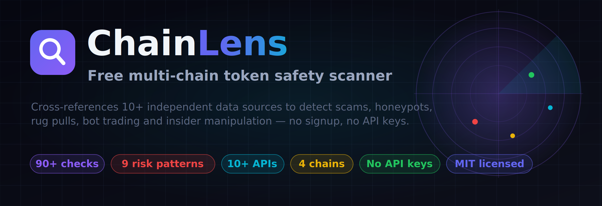
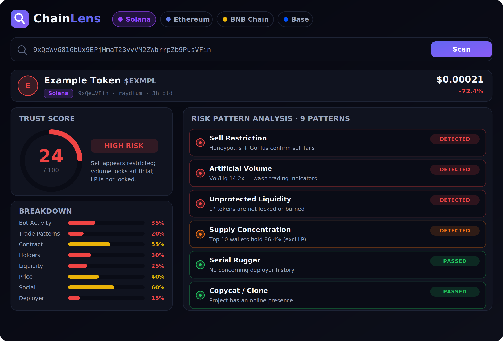
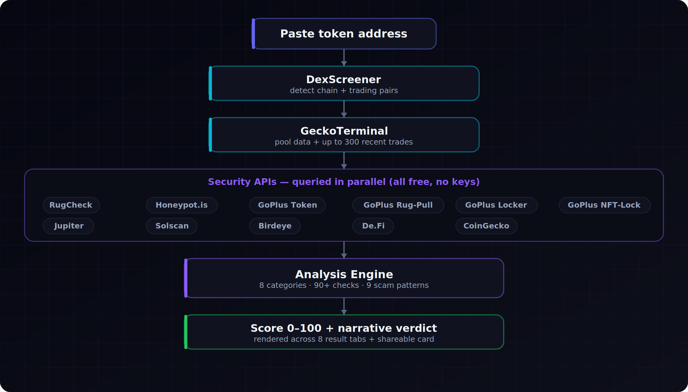

<p align="center">
  
</p>

<h1 align="center">ChainLens</h1>

<p align="center">
  <strong>Free, open-source token safety scanner — 90+ checks · 9 scam patterns · 10+ APIs · zero signup</strong>
</p>

<p align="center">
  <a href="https://finland93.github.io/ChainLens/">
    
  </a>
</p>

<p align="center">
  <a href="https://finland93.github.io/ChainLens/">Live demo</a> ·
  <a href="#-quick-start">Quick start</a> ·
  <a href="#-what-it-detects">What it detects</a> ·
  <a href="#️-how-it-works">How it works</a> ·
  <a href="#-data-sources">Data sources</a> ·
  <a href="#-contributing">Contributing</a>
</p>

<p align="center">
  
  
  
  
  
  
  
  
</p>

---

## What is ChainLens?

ChainLens is a **client-side-only** crypto token safety scanner. Paste any token address and it cross-references **10+ independent data sources** to detect scams, honeypots, rug pulls, wash trading and insider manipulation — then returns a single 0–100 trust score with a plain-English verdict.

- **No signup. No API keys. No wallet connection. No backend.**
- Pure HTML/CSS/JS — clone it, open `index.html`, done.
- Every API call goes **directly from your browser** to public data sources. Your scans never touch a server.

> **Try it now:** [**finland93.github.io/ChainLens**](https://finland93.github.io/ChainLens/) — nothing to install, runs entirely in your browser.

> **Every token is guilty until proven innocent.**

<p align="center">
  
</p>

---

## Why ChainLens?

| Feature | ChainLens | Typical scanners |
|---|---|---|
| Checks per token | **90+** | 10–25 |
| Independent API sources | **10+** | 1–2 |
| Bot / wash-trade detection | ✅ | ❌ |
| 300-trade pattern analysis | ✅ | ❌ |
| Deployer "serial rugger" detection | ✅ | ❌ |
| LP lock **expiry** warning | ✅ | ❌ |
| Copycat / clone detection | ✅ | ❌ |
| Scam pattern matching | **9 patterns** | 0–2 |
| Price | **Free** | Freemium |
| API keys required | **None** | Often |
| Backend / data collection | **None** | Varies |

---

## Supported chains

Paste any address — ChainLens auto-detects the chain via DexScreener.

| Chain | Security sources |
|---|---|
| **Solana** | RugCheck + GoPlus + Jupiter + Solscan + Birdeye |
| **Ethereum** | Honeypot.is + GoPlus + De.Fi |
| **BNB Chain** | Honeypot.is + GoPlus |
| **Base** | Honeypot.is + GoPlus |

---

## 🔍 What it detects

### 90+ individual checks, grouped into 8 categories

| Category | Checks | What it catches |
|---|---|---|
| 🤖 Bot Activity | 12 | Buy/buyer ratio, volume/liquidity, zero sells, spam |
| 📊 Trade Patterns | 12 | Identical volumes, same-second trades, buy streaks, size uniformity |
| 🔒 Contract Security | 25+ | Honeypot, hidden owner, mint, freeze, blacklist, proxy, tax |
| 👥 Holder Distribution | 12 | Concentration, clusters, insiders, burn tricks, exchange filtering |
| 💧 Liquidity Health | 8 | LP lock/burn, lock expiry, deployer ownership, FDV ratio |
| 📈 Price Behavior | 7 | Pump & dump, crash, volatility, Jupiter cross-validation |
| 🌐 Social / Meta | 5 | Logo, website, Twitter, Telegram, CoinGecko listing |
| 🕵️ Deployer History | 8 | Previous tokens, dead-token rate, GoPlus wallet flags |

### 9 scam patterns

1. 🍯 **Sell Restriction (Honeypot)** — cross-validated by up to 3 sources
2. 💧 **Unprotected Liquidity** — LP lock/burn verification
3. 📈 **Rapid Rise & Fall** — pump & dump detection
4. 🔄 **Artificial Volume** — wash-trading indicators
5. 👥 **Supply Concentration** — sybil / insider clustering
6. 🔁 **Serial Rugger** — deployer track record
7. 🎭 **Copycat / Minimal Presence** — clone detection
8. 🕳️ **Gradual Liquidity Drain** — slow-rug detection
9. 🥪 **MEV / Sandwich Risk** — vulnerability assessment

---

## ⚙️ How it works

<p align="center">
  
</p>

1. **DexScreener** identifies the chain and finds the most-liquid trading pair.
2. **GeckoTerminal** provides pool data and up to 300 recent trades (with a CORS-proxy fallback).
3. **Security APIs** are queried in parallel — RugCheck, Honeypot.is, four GoPlus endpoints, Jupiter, Solscan, Birdeye, De.Fi and CoinGecko.
4. The **analysis engine** runs all 90+ checks across 8 categories and matches the 9 scam patterns.
5. A **0–100 score** with a narrative verdict is rendered across 8 result tabs, plus a downloadable share card.

Every scan is resilient: any API can fail and the scan still completes, with an **API Transparency** tab showing exactly which sources responded.

---

## 🚀 Quick start

**Fastest way — [open the live version →](https://finland93.github.io/ChainLens/)** No install, no clone; it runs entirely in your browser at `finland93.github.io/ChainLens`.

Prefer to run it yourself? It's static — no build tools, no dependencies.

```bash
# Clone
git clone https://github.com/Finland93/ChainLens.git
cd ChainLens

# Option A — just open it
open index.html            # macOS  (use "start index.html" on Windows)

# Option B — serve locally (recommended; avoids file:// CORS quirks)
python3 -m http.server 8000
#   → http://localhost:8000

# Option C — any static server
npx serve .
```

Then paste a token address (try **BONK** on Solana or **PEPE** on Ethereum) and hit **Scan**.

### Deploy your own

Because it's fully static, you can host it anywhere — GitHub Pages, Netlify, Vercel, Cloudflare Pages — by serving the repository root. No environment variables, no server. (The [live demo](https://finland93.github.io/ChainLens/) itself runs on GitHub Pages straight from this repo.)

---

## 🗂️ Project structure

```
ChainLens/
├── index.html              # Scanner app (single page)
├── css/
│   └── core.css            # All styles
├── js/
│   ├── chains.js           # Chain config + token-logo fallbacks
│   ├── api.js              # API layer — 10+ sources, CORS proxy, retry
│   ├── analysis.js         # Analysis engine — 90+ checks, 9 patterns
│   ├── feed.js             # Live "new tokens" feed (60s refresh)
│   ├── render.js           # UI rendering — 8 tabs + share card
│   ├── storage.js          # localStorage history/watchlist (zero-knowledge)
│   └── app.js              # App controller — scan flow, rate limiting
├── sw.js                   # Service worker (offline shell cache)
├── site.webmanifest        # PWA manifest
├── robots.txt
└── docs/                   # README images
```

---

## 📐 Scoring methodology

| Score | Verdict | Meaning |
|---|---|---|
| 85–100 | LOW RISK | Few concerns. Standard due diligence applies. |
| 65–84 | MODERATE RISK | Some concerns detected. Research further. |
| 35–64 | ELEVATED RISK | Multiple warning signs. Extreme caution. |
| 15–34 | HIGH RISK | Serious issues. Warning banner shown. |
| 0–14 | EXTREME RISK | Critical issues. Do not interact. |

**Critical override** — a single critical issue caps the score at 40, two at 25, three or more at 15. When no security data is available, the score is capped at 40 with a warning so a lack of data never reads as "safe."

---

## 🔐 Privacy

**Zero-knowledge by design:**

- No backend server, no database, no accounts, no wallet connection.
- No analytics, no ads, no tracking.
- History and watchlist live in your browser's `localStorage` — on your device only.
- All API requests go straight from your browser to the public data sources.

---

## 🤝 Contributing

Contributions are welcome — see [CONTRIBUTING.md](CONTRIBUTING.md).

- 🐛 **Report a bug** — [open an issue](../../issues/new?template=bug_report.md)
- 💡 **Suggest a feature** — [open an issue](../../issues/new?template=feature_request.md)
- 🔧 **Submit code** — fork → branch → PR
- 🌍 **Translate** — help reach more people
- ⭐ **Star the repo** — it genuinely helps visibility

Please also read the [Code of Conduct](CODE_OF_CONDUCT.md) and [Security Policy](SECURITY.md).

---

## ⚠️ Disclaimer

ChainLens is an independent research tool. It does **not** constitute financial advice. No score guarantees a token's safety or profitability. Cryptocurrency carries significant risk, including total loss of capital. Always do your own research.

---

## 📄 License

[MIT License with Attribution](LICENSE) — free to use, modify and distribute, with a request to credit ChainLens and link back to this repository in public-facing derivatives.

---

<p align="center">
  <sub>Built for traders who'd rather verify than trust. ⭐ the repo if it saved you from a bad trade.</sub>
</p>
